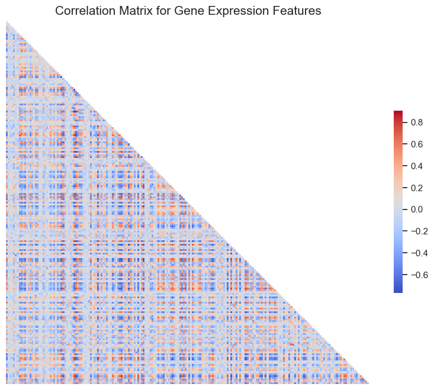

# Drug Data Analysis

## Overview

Welcome to the **Drug Data Analysis** project! This repository contains a comprehensive analysis of drug data using various data science techniques. The primary goal of this project is to explore and visualize drug usage patterns, identify significant trends, and provide meaningful insights using Python.

## Connect with Me

- **LinkedIn:** [https://www.linkedin.com/in/mahshidkhatami-data-analyst/](https://www.linkedin.com/in/mahshidkhatami-data-analyst/)
- **Email:** [khatami.mahshid@gmail.com](mailto:khatami.mahshid@gmail.com)

## Table of Contents

- [Overview](#overview)
- [Features](#features)
- [Getting Started](#getting-started)
- [Data](#data)
- [PCA](#Dimensionality-reduction-via-PCA)
- [Model](#Model)
- [Results](#results)
- [Contributing](#contributing)
- [License](#license)
- [Contact](#contact)

## Features

- **Data Cleaning**: Efficient preprocessing of raw drug data to handle missing values and inconsistencies.
- **Data Visualization**: Interactive visualizations using Matplotlib and Seaborn to showcase drug usage patterns.
- **Statistical Analysis**: In-depth statistical analysis to identify significant trends and correlations.
- **Machine Learning Models**: Implementation of machine learning algorithms to predict outcomes based on drug data.
- **Customizable Pipeline**: A modular pipeline that allows users to customize the analysis according to their needs.

## Prerequisites

Make sure you have Python 3.8+ installed on your machine. You can download Python from [python.org](https://www.python.org/).

## Data

The dataset used for this project contains detailed drug usage information. Each row represents an individual entry with specific attributes such as `drug_id`, `cp_type`, and more.

Train Dataset:

| Column Name | Description                                                    |
|-------------|----------------------------------------------------------------|
| `sig_id`    | Unique identifier for each sample.                             |
| `cp_type`   | Type of compound used; `trt_cp` for treatment and `ctl_vehicle` for control. |
| `cp_time`   | Duration of the treatment in hours (e.g., 24, 48, 72).         |
| `cp_dose`   | Dose of the compound used; `D1` for low dose and `D2` for high dose. |
| `g-0` to `g-771` | Gene expression levels for genes 0 to 771.                |
| `c-0` to `c-99`  | Cell viability measurements for markers 0 to 99.          |

Below is a preview of the dataset showing a few sample identifiers (`sig_id`) and their corresponding drug identifiers (`drug_id`).

Drug Dataset: 

| sig_id      | drug_id   |
|-------------|-----------|
| id_000644bb2| b68db1d53 |
| id_000779bfc| df89a8e5a |
| id_000a6266a| 18bb41b2c |
| id_0015fd391| 8c7f86626 |
| id_001626bd3| 7cbed3131 |

We find:

This is a rather wide dataset with almost 900 columns. From the data description we learn that features starting with “g-” encode gene expression data (there are 772 of those), and features starting with “c-” (100 in total) show cell viability data.

In addition, we have 3 “cp_” features: cp_type incidates the sample treatment, while cp_time and cp_dose encode the duration and dosage of the treatment.

The sig_id is the unique primary key of the sample.

## Getting Started
We start by plotting the distributions of the various predictor and target features individually

Those are essentially anonymised features, labelled from “g-0” to “g-771”. Their values are numeric, so let’s look at the densities for the first 4 gene features as an example:

Similar to the gene features, the cell viability features are anonymous, labelled from “c-0” to “c-99”; 100 features. Their distributions look as follows:

Let’s zoom into the negative tails, and add 2 more features:

Comparing the 3 treatment features calls for a facet grid. Two features span the horizontal and vertical grid axes, the 3rd one defines the plot within each facet:

We find:

The resulting picture is consistent with the overall view we saw above. Control treatments are similarly rare across doses and durations.

One noteable difference, however, is the slightly higher percentage of 48-hour treatments for D1 doses (for both control and compound), compared to the much more equally distributed D2 bars.

Here are the correlations between the first 200 gene features. No labels (and no title, apparently), just colour coding for high correlations (blue) and anti-correlations (red):

A closer look at a subset of features:

Here, we pick 4 example pairs of features and plot them together with simple linear fits. The individual plot titles give the feature names and their Pearson correlation coefficient values:

Let’s start with breaking down by treatment features the distributions of 4 gene and cell features that were chosen completely at random. Here, the 4 features are arranged vertically while the treatment duration defines the horizonal facets. The treatment dose is colour-coded. The area where both distributions overlap is a mix between both colours:

# Dimensionality reduction via PCA
Given the notable amount of correlations in the gene and, especially, the cell features, let’s test some dimensionality reduction methods, to see by how much we could reduce our feature space.

Here, we will focus on principal component analysis (PCA). PCA is essentially a rotation of the parameter space so that the new axes (the “principal components” aka PC) are orthogonal and align with the directions of maximum variance. We’ll start with the gene features, then look at the cell features.

Our first plot will show the amount of variance explained by each PC for the first 5 PCs (a “Scree Plot”), alongside the direction and magnitude (colour) of the contribution of the original features to the first 2 PCs. The PCA visuals are produced via the excellent factoextra package.

I’m showing the top 15 variables in each PC dimension. (The dashed horizontal line shows the expected value for a uniform distribution):

# Model
In the final step of this exploration, let’s use some of the insights that we gained to build a baseline model to get us started on the leaderboard. This model won’t be competitive on its own, but can be easily adjusted and expanded.

So far, neural network (NN) models appear to be performing best in this competition. Therefore, we will build our own starter NN using Keras/Tensorflow.

# Drug
For the sake of completeness, as this competition enters its final days, here is an overview of the additional file of drug IDs (train_drug.csv).

With the control rows out of the way, we can focus on the “real” drugs only. This density distribution looked rather suspicious - with its multiple sharp peaks and general lack of smoothness.We again count the number of rows per drug_id, and then count the number of those row counts. (E.g. there are 3 drugs with a count of exactly 2 instances.) Then we treat those row counts as a categorical feature and display the drug counts via a barplot.

